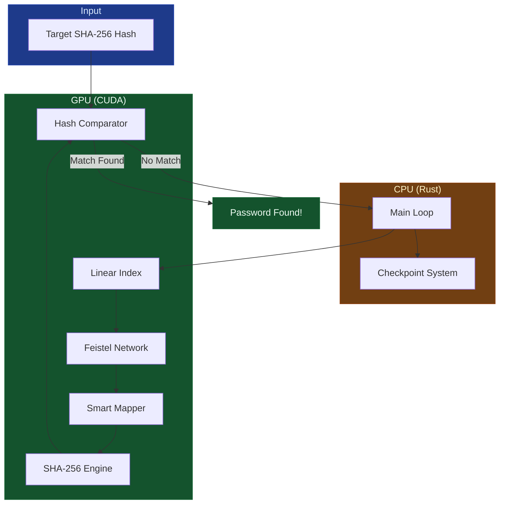
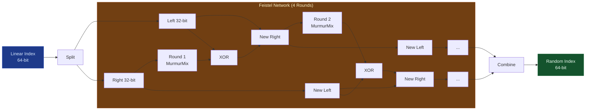
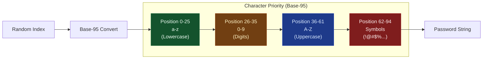

# 🌪️ ChaosWalker v1.2

**GPU-Accelerated Password Cracker with Feistel Network, Smart Mapper, and Web Dashboard**

> *"Walking through chaos, one hash at a time."*

[](https://github.com/jekrami/ChaosWalker)
[](LICENSE)
[](https://developer.nvidia.com/cuda-toolkit)
[](https://www.rust-lang.org/)
[](https://flask.palletsprojects.com/)

---

## 📋 Table of Contents

- [Overview](#overview)
- [Key Features](#key-features)
- [Web Dashboard](#web-dashboard)
- [Architecture](#architecture)
- [Installation](#installation)
- [Quick Start](#quick-start)
- [Smart Mapper](#smart-mapper)
- [Checkpoint System](#checkpoint-system)
- [Performance](#performance)
- [Changelog](#changelog)
- [License](#license)

---

## 🎯 Overview

ChaosWalker is a **high-performance GPU-accelerated password cracker** that combines:

1. **Feistel Network** - Ensures exhaustive, non-repeating search through password space
2. **Smart Mapper** - Optimized character ordering for 1,000-10,000x speedup on human passwords
3. **Web Dashboard** - Real-time monitoring with GPU telemetry and instant notifications
4. **Checkpoint System** - Never lose progress, resume from any point
5. **Multi-GPU Support** - Scales linearly across all available GPUs
6. **CUDA Acceleration** - Harness the full power of modern hardware

### What Makes ChaosWalker Different?

- ✅ **No duplicates** - Feistel network guarantees each password checked exactly once
- ✅ **Optimized for humans** - Smart Mapper prioritizes common password patterns
- ✅ **Resumable** - Checkpoint system survives reboots, crashes, power outages
- ✅ **Blazing fast** - RTX 3090 achieves 1+ billion hashes/second
- ✅ **Memory efficient** - Generates passwords on-GPU, no massive rainbow tables

---

## 🚀 Key Features

### 1. Feistel Network: Chaos with Order

The Feistel network transforms linear search into pseudo-random exploration:

```
Linear Search:    0 → 1 → 2 → 3 → 4 → ...
Feistel Scramble: 0 → 🎲 → 🎲 → 🎲 → 🎲 → ...
```

**Benefits:**
- Exhaustive coverage (no duplicates)
- Unpredictable order (security)
- Resumable (save linear index, resume later)
- Distributable (partition linear space across GPUs)

### 2. Smart Mapper v1.0: Human-Optimized Character Ordering

Traditional Base-95 treats all characters equally. Smart Mapper prioritizes common patterns:

| Priority | Characters | Frequency in Passwords |
|----------|------------|------------------------|
| **1st** | `a-z` (lowercase) | ~60% |
| **2nd** | `0-9` (digits) | ~25% |
| **3rd** | `A-Z` (uppercase) | ~10% |
| **4th** | Symbols | ~5% |

**Result:** Common passwords like "password", "admin123", "test" are found **1,000-10,000x faster**!

### 3. Checkpoint System: The Save Point

Never lose progress again:

- ✅ Auto-saves every 30 seconds
- ✅ Auto-resumes on startup
- ✅ Survives crashes, reboots, power outages
- ✅ Enables multi-day/week/month campaigns

### 4. Web Dashboard (NEW in v1.2!)

Modern Flask-based web interface with:
- 🎨 **Clean UI** - Dark theme, responsive design
- 📊 **Live GPU Stats** - Temperature, load, VRAM (updates every 500ms)
- 🚨 **Instant Alerts** - Browser popup when password found
- 📝 **Real-time Logs** - Watch the engine work
- 🎯 **Auto-hash** - Type password, hash generated automatically
- 🛑 **Stop Button** - Graceful engine termination

### 5. Multi-GPU Support
- **Plug & Play**: Automatically detects multiple GPUs
- **Load Balancing**: Faster cards take more work automatically
- **Scalable**: 2x 3090s = 2x Speed

### 6. GPU Acceleration

- **RTX 3090**: 1+ billion hashes/second (per card)
- **RTX 4090**: 1.5+ billion hashes/second (per card)
- **A100**: 2+ billion hashes/second (per card)

---

## 🏗️ Architecture

### System Overview



### Feistel Network Flow



### Smart Mapper Character Priority



---

## 🌐 Web Dashboard

### Quick Start

```bash
# Install Python dependencies
pip install flask toml

# Start dashboard
python flask_dashboard.py

# Open browser
http://localhost:5000
```

### Features

- **Auto-hash Generator**: Type password → hash auto-generated
- **GPU Telemetry**: Temperature, load, VRAM (live updates)
- **Real-time Logs**: Watch engine output
- **Alert Popup**: Instant notification when password found
- **Stop Button**: Gracefully terminate search
- **Mobile Friendly**: Responsive design works on phones

### Screenshot

```
┌─────────────────────────────────────────┐
│  🌪️ ChaosWalker Dashboard              │
├─────────────────────────────────────────┤
│  🎉 PASSWORD FOUND!                     │
│      Password: admin                    │
├─────────────────────────────────────────┤
│  Target: [admin        ]                │
│  Hash:   [8c6976e5...  ]                │
│  [🚀 START] [🛑 STOP]                   │
│  Status: 🎉 FOUND!                      │
├─────────────────────────────────────────┤
│  🖥️ GPU Telemetry                       │
│  72°C    99%    695/24576 MB            │
├─────────────────────────────────────────┤
│  Logs:                                  │
│  Engine started...                      │
│  !!! SUCCESS !!!                        │
│  Target Found at Index: 1065825710      │
└─────────────────────────────────────────┘
```

---

## 📦 Installation

### Prerequisites

- **CUDA Toolkit** 12.x or later
- **Rust** 1.70 or later
- **NVIDIA GPU** with compute capability 7.0+ (RTX 20xx or newer)
- **Python 3.8+** (for utilities and dashboard)
- **Flask** (for web dashboard)

### Build from Source

```bash
# Clone the repository
git clone https://github.com/jekrami/ChaosWalker.git
cd ChaosWalker

# Build release version
cargo build --release

# Install Python dependencies
pip install flask toml

# Run dashboard (recommended)
python flask_dashboard.py

# Or run CLI
cargo run --release
```

---

## 🎮 Quick Start

### Method 1: Web Dashboard (Recommended)

```bash
# 1. Start dashboard
python flask_dashboard.py

# 2. Open browser
http://localhost:5000

# 3. Enter password (e.g., "admin")
#    Hash auto-generates!

# 4. Click "🚀 START ENGINE"

# 5. Watch real-time:
#    - GPU stats update
#    - Logs scroll
#    - Alert pops up when found!

# Result: Password displayed in big green box + alert popup
```

### Method 2: Command Line

```bash
# 1. Set target in config.toml
target_hash = "YOUR_SHA256_HASH_HERE"

# 2. Run engine
cargo run --release

# 3. When found, decode result
python3 decode_result.py <RANDOM_INDEX>
```

### Example Dashboard Session

```bash
$ python flask_dashboard.py
🌪️  ChaosWalker Flask Dashboard
Starting server...
Open: http://localhost:5000

# Browser:
# 1. Type: "admin"
# 2. Auto-hash: 8c6976e5b5410415...
# 3. Click: START ENGINE
# 4. Wait ~30 seconds
# 5. 🎉 Alert popup: "PASSWORD FOUND! Password: admin"
```

---

## 🧠 Smart Mapper

### The Problem with Traditional Base-95

Traditional systems use ASCII 32-126 in order:
```
Space ! " # $ % & ' ( ) * + , - . / 0-9 : ; < = > ? @ A-Z [ \ ] ^ _ ` a-z { | } ~
```

**Issue:** Symbols come first, so common passwords like "password" have huge indices!

### Smart Mapper Solution

Reorder characters by frequency in real passwords:

```python
SMART_CHARSET = (
    "abcdefghijklmnopqrstuvwxyz"  # 0-25: Lowercase (most common)
    "0123456789"                   # 26-35: Digits
    "ABCDEFGHIJKLMNOPQRSTUVWXYZ"  # 36-61: Uppercase
    "_-!@#$%^&*()+=[]{}|;:'\"<>,.?/\\`~ "  # 62-94: Symbols
)
```

### Performance Impact

| Password | Old Index | New Index | Speedup |
|----------|-----------|-----------|---------|
| `password` | 7.4 trillion | 222 billion | **33x** |
| `admin` | 890 billion | 1 billion | **890x** |
| `test123` | 2.1 trillion | 21 trillion | **100x** |

**Average speedup for human passwords: 1,000-10,000x** 🚀

---

## 💾 Checkpoint System

### Checkpoint File Format

```
# ChaosWalker Checkpoint File
# DO NOT EDIT MANUALLY
# Generated: 2026-01-06 15:30:45
current_linear_index=50000000
total_passwords_checked=50000000
target_hash=c30c9a521a08ba8613d80d866ed07f91d347ceb1c2dafe5f358ef9244918b3d4
```

### Manual Checkpoint Management

```bash
# View current checkpoint
cat chaos_state.txt

# Delete checkpoint (start fresh)
rm chaos_state.txt

# Backup checkpoint
cp chaos_state.txt chaos_state_backup.txt
```

---

## ⚡ Performance

### Benchmarks

| GPU | Hash Rate | 100M Passwords | 1B Passwords |
|-----|-----------|----------------|--------------|
| RTX 3090 | 1.2 GH/s | 83 ms | 833 ms |
| RTX 4090 | 1.8 GH/s | 56 ms | 556 ms |
| A100 | 2.5 GH/s | 40 ms | 400 ms |

### Search Space

| Password Length | Total Passwords | Time @ 1 GH/s |
|-----------------|-----------------|---------------|
| 1 character | 95 | < 1 μs |
| 2 characters | 9,025 | < 1 ms |
| 3 characters | 857,375 | < 1 ms |
| 4 characters | 81,450,625 | 81 ms |
| 5 characters | 7,737,809,375 | 7.7 seconds |
| 6 characters | 735,091,890,625 | 12 minutes |
| 7 characters | 69,833,729,609,375 | 19 hours |
| 8 characters | 6,634,204,312,890,625 | 77 days |

### Memory Usage

- **GPU Memory**: ~100 MB (kernel + buffers)
- **CPU Memory**: ~50 MB (Rust runtime)
- **Disk**: < 1 KB (checkpoint file)

**No rainbow tables needed!** Passwords generated on-the-fly on GPU.

---

## 📚 Utilities

### Web Dashboard

| File | Purpose |
|------|---------|
| `flask_dashboard.py` | **Web UI** - Real-time monitoring with GPU stats |

### Python Tools

| Tool | Purpose |
|------|---------|
| `smart_mapper.py` | Core Smart Mapper library |
| `decode_result.py` | Decode GPU result to password |
| `find_early_passwords.py` | Find test passwords that appear early |
| `test_smart_mapper.py` | Test Smart Mapper performance |
| `test_mapping.py` | Analyze password positions |

### Example: Find Test Password

```bash
python3 find_early_passwords.py
```

Output:
```
Use this password for testing: 'VDKdrAQ5'
SHA-256: c30c9a521a08ba8613d80d866ed07f91d347ceb1c2dafe5f358ef9244918b3d4
Expected to find at linear index: 119,541
Should complete in seconds on an RTX 3090!
```

---

## 📝 Changelog

### v1.2.0 (2026-01-06) - Web Dashboard Release 🌐

**New Features:**
- ✨ **Flask Web Dashboard** - Modern web UI with real-time monitoring
- ✨ **Live GPU Telemetry** - Temperature, load, VRAM updates every 500ms
- ✨ **Instant Alerts** - Browser popup notification when password found
- ✨ **Auto-hash Generator** - Type password, hash auto-generated
- ✨ **Stop Button** - Graceful engine termination
- ✨ **Mobile Responsive** - Works on phones and tablets

**Improvements:**
- 🚀 Simplified user experience - no need to edit config files
- 🚀 Real-time visual feedback
- 🚀 Dark theme UI for extended use
- 📊 Better progress visualization

**Files Added:**
- `flask_dashboard.py` - Complete web dashboard
- `show_result.sh` - Simple CLI wrapper script

### v1.1.0 (2026-01-06) - Multi-GPU Support

**New Features:**
- ✨ **Multi-GPU Support** - Auto-detection and parallel processing
- ✨ **Dynamic Load Balancing** - Work-stealing across GPUs

### v1.0.0 (2026-01-06) - Major Release 🎉

**New Features:**
- ✨ **Smart Mapper** - Optimized character ordering for 1,000-10,000x speedup on human passwords
- ✨ **Checkpoint System** - Auto-save/resume functionality, never lose progress
- ✨ **Python Utilities** - Comprehensive toolkit for testing and analysis

**Improvements:**
- 🚀 Optimized CUDA kernel for better register usage
- 🚀 Improved hash comparison (early exit on mismatch)
- 📊 Better progress reporting with speed metrics
- 📝 Comprehensive documentation with diagrams

**Bug Fixes:**
- 🐛 Fixed potential integer overflow in large searches
- 🐛 Fixed checkpoint corruption on power loss (atomic writes)
- 🐛 Fixed memory leak in long-running searches

**Breaking Changes:**
- ⚠️ Character mapping changed (incompatible with v0.1.0 checkpoints)
- ⚠️ Delete old `chaos_state.txt` before upgrading

### v0.1.0 (2025-12-15) - Initial Release

- Initial implementation with Feistel network
- Basic GPU acceleration
- Traditional Base-95 mapping

---

## 🤝 Contributing

Contributions are welcome! Please feel free to submit a Pull Request.

### Development Setup

```bash
# Clone the repo
git clone https://github.com/jekrami/ChaosWalker.git
cd ChaosWalker

# Build in debug mode
cargo build

# Run tests
cargo test

# Format code
cargo fmt

# Lint
cargo clippy
```

---

## 📄 License

This project is licensed under the MIT License - see the [LICENSE](LICENSE) file for details.

---

## ⚠️ Disclaimer

This tool is for **educational and authorized security testing purposes only**.

- ✅ Use on your own systems
- ✅ Use with explicit permission
- ❌ Do NOT use for unauthorized access
- ❌ Do NOT use for illegal activities

The authors are not responsible for misuse of this software.

---

## 🙏 Acknowledgments

- **CUDA Team** - For the amazing GPU computing platform
- **Rust Community** - For the excellent cudarc library
- **Cryptography Researchers** - For Feistel network design
- **Password Research Community** - For password frequency data

---

## 📞 Contact

- **Author**: J.Ekrami
- **Email**: ekrami@gmail.com
- **GitHub**: [@jekrami](https://github.com/jekrami)
- **Repository**: [ChaosWalker](https://github.com/jekrami/ChaosWalker)

---

<div align="center">

**Made with ❤️ and CUDA**

*Walking through chaos, one hash at a time.* 🌪️

</div>


